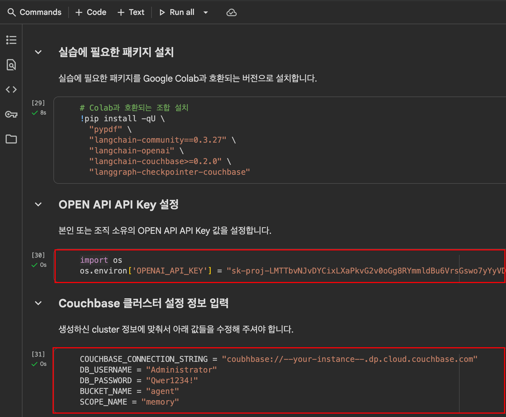

# 3.5 노드 5와 6을 클러스터에 추가

## 1. 노드 5 추가

브라우저에서 노드 5로 접속하여 설정 시작 화면을 엽니다:

```
http://<node5>:8091
```


<figure><figcaption></figcaption></figure>

`Join Existing Cluster`를 선택합니다.


<figure><figcaption></figcaption></figure>


다음 정보를 입력합니다:\
• `Cluster` Host Name/IP Address: 노드 1(또는 노드 1\~4 중 하나)의 Amazon EC2 주소를 지정합니다.\
• Configure Services & Settings For This Node\
&#x20;   Host Name/IP Address: 노드 5의 Amazon EC2 주소를 지정합니다.\
• `Cluster` `Admin` `Username`: Administrator\
• `Cluster` `Admin` `Password`: couchbase\
• Services 체크박스: `Index`, `Search`, `Query`, `Backup`을 선택하고 Data 서비스는 선택 해제합니다.\
• Index 디스크 경로: `/opt/couchbase/var/lib/couchbase/index`\
• Eventing 디스크 경로: `/opt/couchbase/var/lib/couchbase/eventing`\
• Analytics 디스크 경로: `/opt/couchbase/var/lib/couchbase/analytics`

마지막으로 `Join Cluster`를 클릭합니다.


## 2. 노드 6 추가

이전 단계(1단계)의 과정을 6번째 노드에 대해 반복하고, 서비스로 Index 서비스, Query 서비스, Search 서비스, 그리고 Backup 서비스를 선택합니다.

이제 재균형(Rebalance)을 대기 중인 노드가 2개 있을 것이며, 서버 페이지에서 빨간색으로 표시된 “Add pending rebalance” 메시지를 확인할 수 있습니다.


<figure><figcaption></figcaption></figure>


오렌지색 Rebalance 버튼을 클릭하여 클러스터에 추가합니다.

이 경우 노드들은 추가되지만, 인덱스, 쿼리 서비스, 서치 서비스를 제공하는 노드들이기 때문에 데이터 서비스 리밸런싱의 특징인 vbucket 마이그레이션에는 참여하지 않습니다.


## 3. Cluster 이름 변경

노드들이 리밸런싱되는 동안 Settings 탭으로 이동하여 클러스터 이름을 `6 Node Cluster`로 변경합니다.

<figure><figcaption></figcaption></figure>


`Save` 버튼을 클릭합니다.

상단의 파란색 리본에 있는 클러스터 제목이 변경된 것을 확인할 수 있습니다.

<figure><figcaption></figcaption></figure>


## 4. 노드를 그룹 2로 이동

Servers 페이지에서 클러스터에 있는 6개의 서버를 확인할 수 있습니다.

오른쪽 상단의 `Groups` 링크를 클릭합니다.

<figure><figcaption></figcaption></figure>


모든 서버는 CLI를 사용해 Group 2에 수동으로 추가한 한 대의 서버를 제외하고 Group 1에 있을 것입니다.

Groups 페이지에서 데이터 서비스를 제공하는 서버 한 대를 Group 2로 이동하고, 화면 오른쪽의 move to 드롭다운을 사용해 Index, Query, Search 서비스를 제공하는 서버 한 대도 Group 2로 이동시킵니다.

<figure><figcaption></figcaption></figure>

두 개의 그룹이 있어야 하며, 각 그룹에는 세 개의 노드가 있어야 합니다:\
• 데이터 서비스를 실행하는 노드 2대\
• 인덱스, 쿼리, 서치 서비스를 실행하는 노드 1대

보류 중인 작업을 확인합니다.

<figure><figcaption></figcaption></figure>

`Apply Changes`를 클릭합니다.

해당 그룹 소속의 변경 사항을 확인합니다.

<figure><figcaption></figcaption></figure>


이제 `Servers` 페이지로 돌아갑니다.

화면 상단에 표시되는 다음 메시지를 확인합니다.

<figure><figcaption></figcaption></figure>



Moving servers into different groups will cause a need to move replica data to comply with new requirements for placement and necessitate a need for a rebalance.



## 5. 인덱스 검사

Indexes 페이지로 이동합니다. 오른쪽 드롭다운에서 `View by server node`를 선택합니다. 왼쪽 드롭다운에서는 all buckets와 all \_default scopes를 선택합니다.

모든 인덱스가 `노드 1(클러스터의 첫 번째 노드)`에 있음을 확인합니다.

<figure><figcaption></figcaption></figure>


## 6. 노드 1을 클러스터에서 제거

Servers 페이지에서 노드 1의 GUI를 열고 Remove를 선택합니다.

<figure><figcaption></figcaption></figure>

<figure><figcaption></figcaption></figure>


## 7. 리밸런스를 수행합니다.

이제 `Rebalance` 버튼을 클릭합니다.

<figure><figcaption></figcaption></figure>

리밸런스가 완료되면, 남아 있는 인덱스들이 이전에 추가한 새로운 인덱스 노드로 마이그레이션된 것을 확인합니다.

<figure><figcaption></figcaption></figure>


## 8. 노드 1을 클러스터에 다시 추가

이제 “join an existing cluster” 절차를 사용하여 노드 1을 클러스터에 다시 추가합니다. 브라우저에서 노드 1로 이동해 설정 시작 화면을 엽니다:

```bash
http://<node1>:8091
```

<figure><figcaption></figcaption></figure>

Join Existing Cluster를 선택합니다.

\
필요한 정보를 입력할 때, 클러스터와 조인할 노드 이름 모두에 Amazon EC2 주소를 사용해야 합니다.

* Cluster Host Name/IP Address: 노드 2\~6 중 하나의 Amazon EC2 주소를 지정합니다.
* Services: Data 서비스를 선택하고, 다른 서비스는 선택 해제합니다.
* Index 경로 수정: `/opt/couchbase/var/lib/couchbase/index` 로 설정합니다.


<figure><figcaption></figcaption></figure>


`Join Cluster`를 클릭합니다.

<figure><figcaption></figcaption></figure>


## 9. 클러스터를 다시 리밸런스

클러스터를 리밸런스하려면 오렌지색 `Rebalance` 버튼을 클릭합니다.

<figure><figcaption></figcaption></figure>


리밸런스가 성공적으로 완료되었는지 확인합니다.

<figure><figcaption></figcaption></figure>


수고하셨습니다. 이번 실습을 완료하셨습니다.
